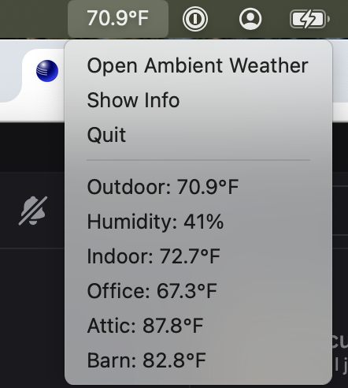

# MenuTemp
This is a *very* basic app to solve my own problem.

If it solves your problem too...great!

I take pull requests, if you add features to it.

## ScreenShots



## What does this app do?

This app reads from a particular weather station on https://ambientweather.net, and displays the temperature in the Mac menu bar.

## Configuration

You'll need an api key, and an application key from Ambient Weather.

Add something similar to the following to a file in your home dir, named `~/.ambient_config.json`:
```
{
  "api_key": "YOUR_API_KEY_FROM_AMBIENT_WEATHER",
  "application_key": "YOUR_APP_KEY_FROM_AMBIENT_WEATHER",
  "update_seconds": 60,
  "sensors": [
    {
      "name": "Outdoor",
      "key": "tempf",
      "unit": "°F"
    },
    {
      "name": "Indoor",
      "key": "tempinf",
      "unit": "°F"
    },
    {
      "name": "Office",
      "key": "temp1f",
      "unit": "°F"
    },
    {
      "name": "Attic",
      "key": "temp2f",
      "unit": "°F"
    },
    {
      "name": "Barn",
      "key": "temp3f",
      "unit": "°F"
    }
  ]
}
```
The `sensors` array will be displayed in the menu, when you click on it.
This file is also in the source tree as an .example file.

## Making the app
This app relies on python. To make this work consistently, I've set up a Makefile, for setting up a local python virtual environment for this app.
```
# set up python
make python-virtualenv

# make the app
make

# run the app from the command line
make debug

# install the app to /Applications
make install

# run the app from /Applications
make run
```

## Signing

Since this is a personal project, I don't have intentions of signing, or distributing official versions of this.

